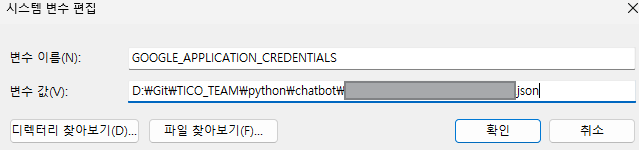

# Chatbot 사용설명서 

### 📄 conda install list
```shell
conda create -n tico python=3.9.21  # 아나콘다 가상환경 설정, conda create -n <가상환경명> python=<버전>
conda env list               # 가상환경 활성화 확인 

conda activate tico          # 생성한 가상환경을 활성화하는 방법
conda list     # conda 설치 목록 확인 

conda install flask          # 웹 애플리케이션 프레임 워크, version 3.1.0 
conda install flask-cors     # Flask CORS (Cross-Origin Resource Sharing) 라이브러리, 3.0.10
conda install -c conda-forge pymysql       # MariaDB 연동, 1.0.2
conda install python-dotenv  # env 파일 로드, 0.21.0
conda install requests       # HTTP 요청, 2.32.3 (HTML 반환)
conda install beautifulsoup4 # 크롤링 용, HTML, XML 문서에서 원하는 데이터를 쉽게 추출할 수 있도록 도와주는 파이썬 라이브러리
conda install -c conda-forge selenium   # 브라우저 자동화 도구, 실제 브라우저처럼 동작해서 렌더링된 요소까지 볼 수 있음(javascript 동적 구조도 가져올 수 있음)
pip install webdriver-manager  # Selenium을 사용할 때 브라우저 드라이버를 자동으로 다운로드하고 관리

# conda 라이브러리 구축 안되어있을 경우 참조
conda install -c conda-forge numpy=1.26.4
conda install -c conda-forge pandas=2.2.3
conda install -c conda-forge matplotlib=3.9.2
conda install -c conda-forge scikit-learn=1.6.1
conda install -c conda-forge scipy=1.13.1
conda install -c conda-forge seaborn=0.13.2

# 구글 라이브러리는 pip install 만 가능 (conda prompt 환경에서 설치)
pip install --upgrade google-cloud-speech   # google-speech 라이브러리 

```
<br/><br/>

### 💾 시스템 환경 변수 설정 
Google Cloud Speech-to-Text에서 발급한 json키를 환경변수에 등록한다. 
<br/><br/>



### 파이썬 서버 실행 
python/chatbot/speech-to-text.py 파일 켜서 Run Code -> Python Flask 서버 실행 