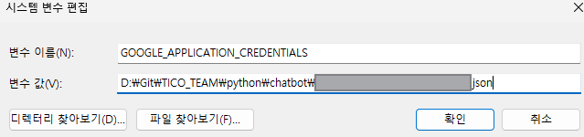

# Chatbot 사용설명서 

### 📄 pip install list
```shell
pip install flask          # 웹 애플리케이션 프레임 워크
pip install --upgrade google-cloud-speech   # google-speech 라이브러리 
pip install cx_Oracle      # oracle db 연동
pip install python-dotenv  # env 파일 로드
pip install flask_cors     # Flask CORS (Cross-Origin Resource Sharing) 라이브러리
```
<br/><br/>

### 💾 시스템 환경 변수 설정 
Google Cloud Speech-to-Text에서 발급한 json키를 환경변수에 등록한다. 
<br/><br/>



### 파이썬 서버 실행 
python/chatbot/speech-to-text.py 파일 켜서 Run Code -> Python Flask 서버 실행 